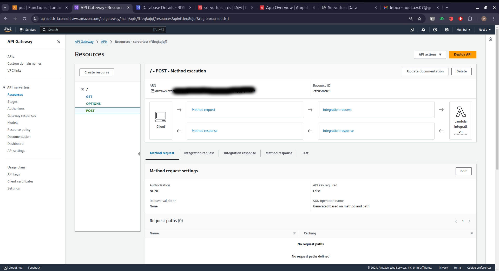
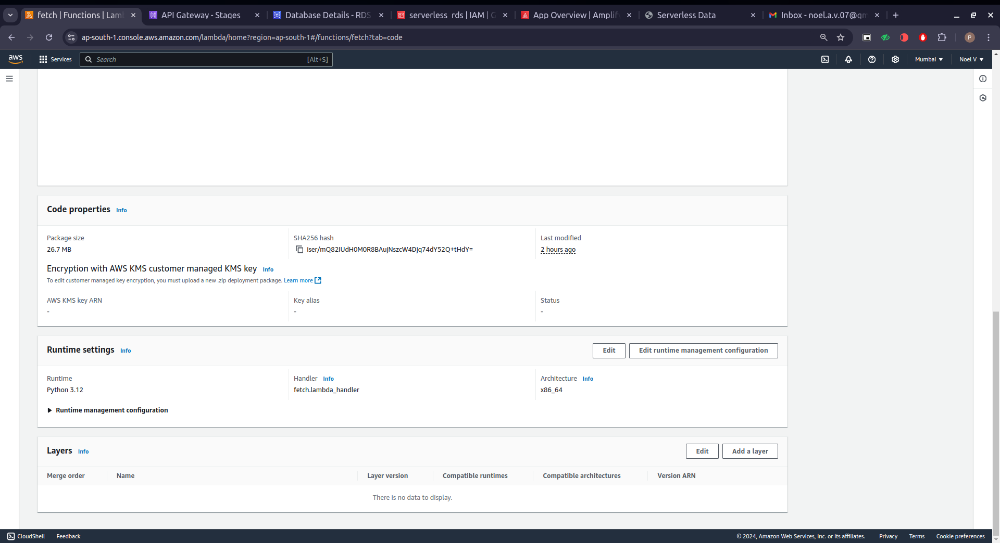
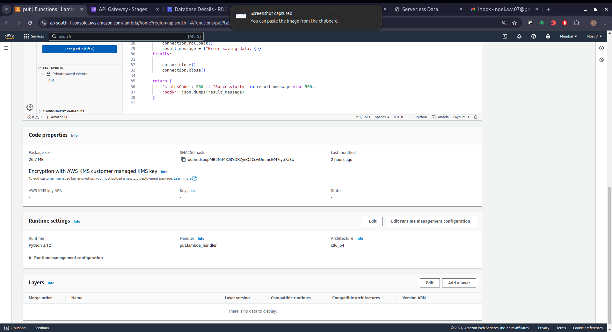
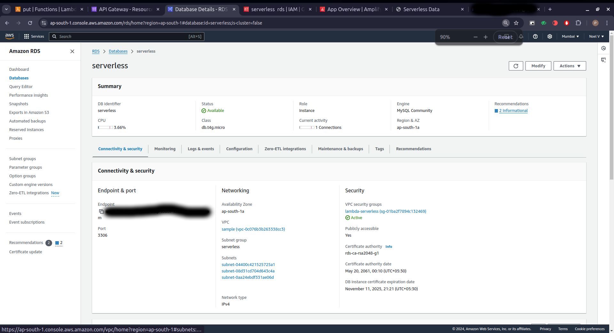
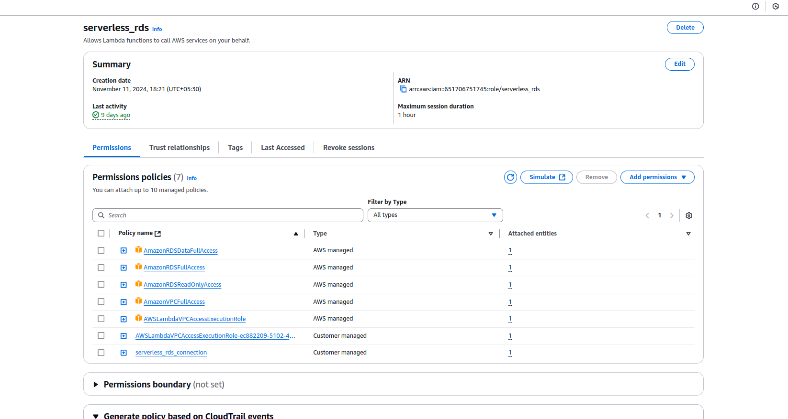

# Serverless Web Application with AWS Amplify, Lambda, API Gateway, and RDS

Upon interacting with buttons or submitting forms hosted on **AWS Amplify**, the requests are routed via **Amazon API Gateway** to trigger the appropriate **AWS Lambda functions**. These functions process the request, fetch or update data stored in an **Amazon RDS MySQL** database, and return the response to the user seamlessly. **IAM roles and policies** ensure secure and restricted access to backend resources, providing a reliable and scalable user experience.

---

## Components Used  

### Frontend  
- **AWS Amplify**: Deployed and hosted the web application for a responsive and user-friendly interface.

### Backend  
- **AWS Lambda**: Serverless functions to handle API requests and execute application logic.  
- **Amazon API Gateway**: Managed the routing and security of HTTP requests to Lambda functions.  
- **Amazon RDS MySQL**: Secure and scalable relational database to store and retrieve user data.  

### Security  
- **IAM Roles and Policies**: Configured to grant minimal and precise permissions for secure access to resources.

---

## Features  
- Fully serverless architecture for easy scaling and maintenance.  
- API-driven backend ensures efficient communication between components.  
- Secure storage and retrieval of user data in **Amazon RDS MySQL**.  
- Role-based access control using **IAM** for optimal security.  
- Hosted on **AWS Amplify** for a high-performance, globally available frontend.

---

## Screenshots  

### 1. Homepage Interface  

### 2. API Gateway Configuration  

### 3. Lambda Function Execution  

### 4. Database (RDS) Overview  

### 5. IAM Policies and Roles  

